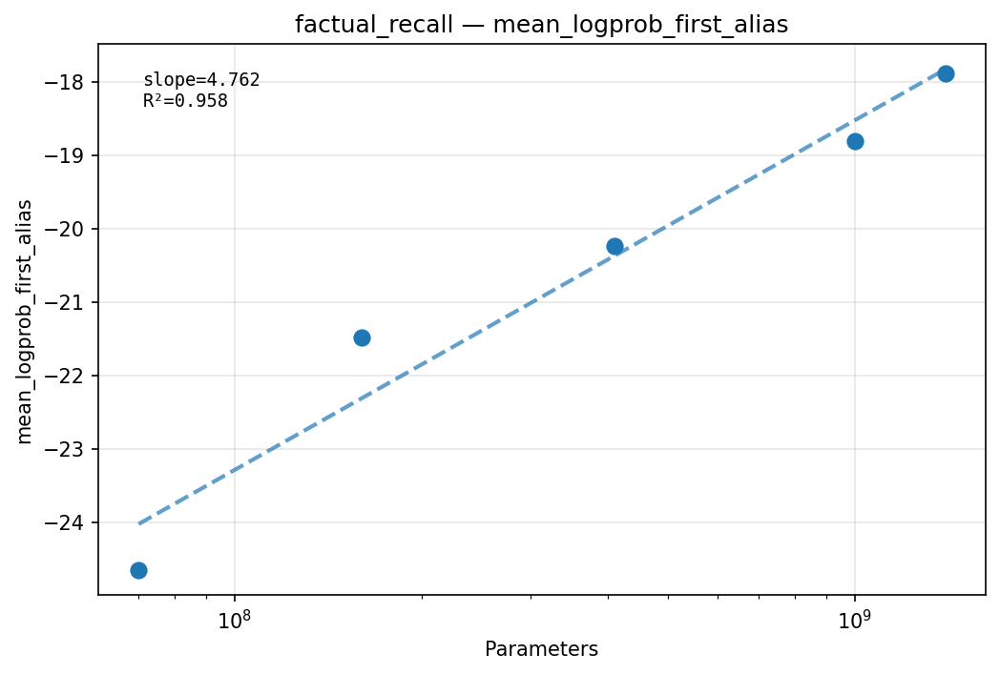
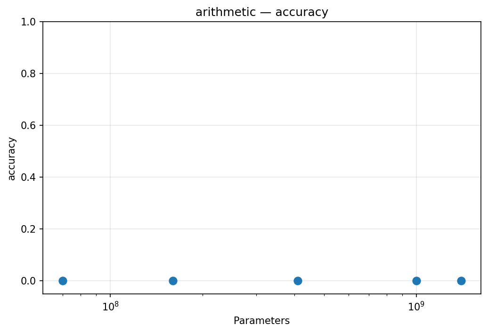
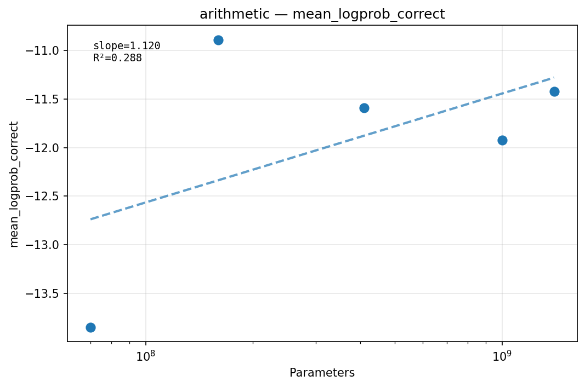
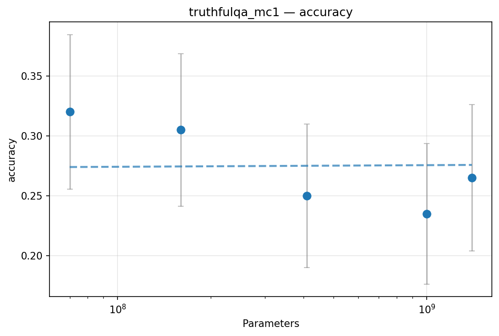
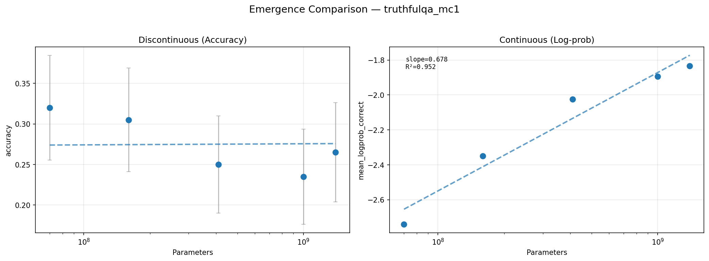
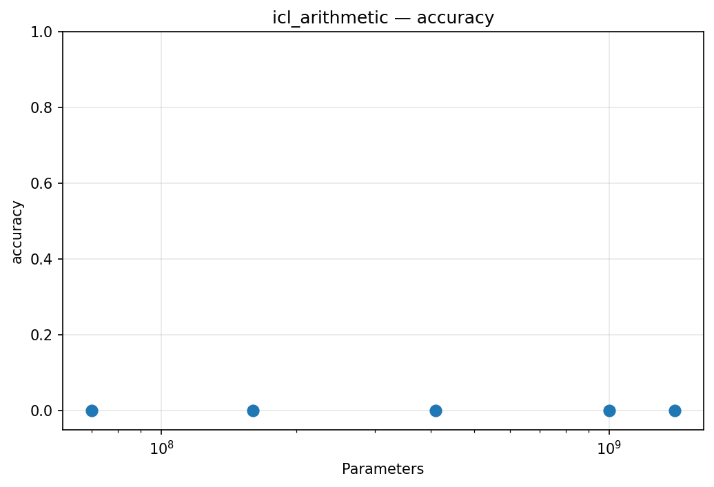
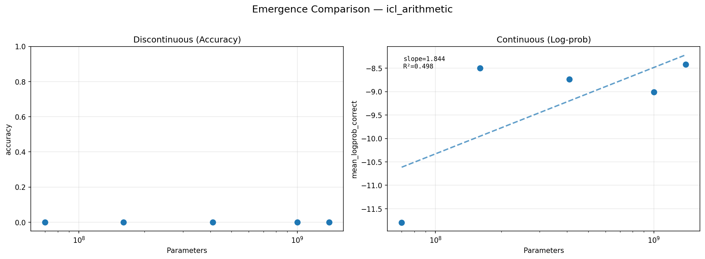
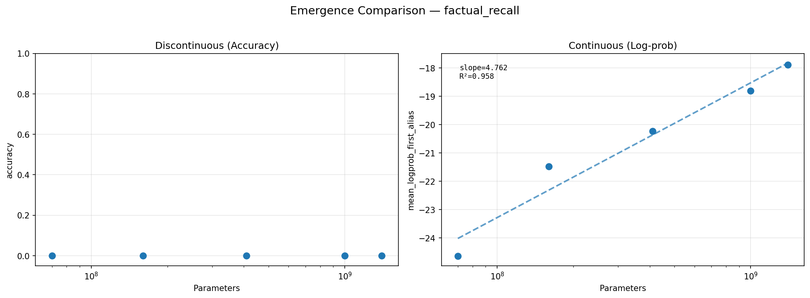
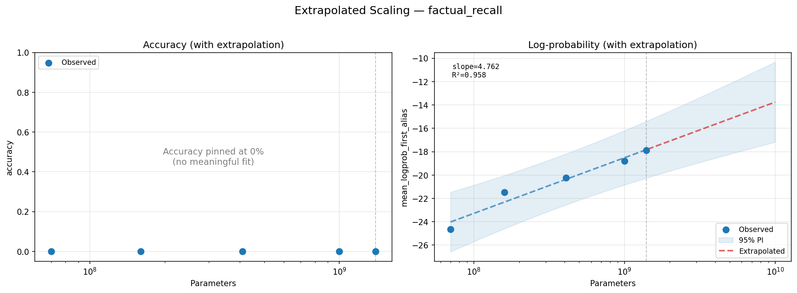
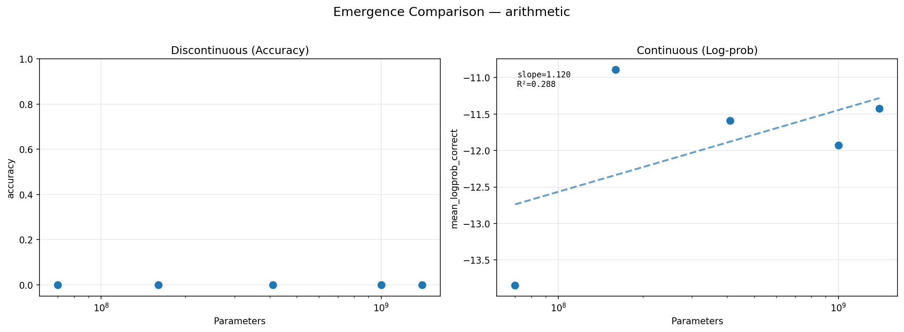

# Scaling & Emergence in Language Models

## Abstract / TL;DR

Apparent emergence in language models is an artifact of discontinuous evaluation metrics, not a phase transition in capability. We demonstrate this by evaluating the Pythia family (70M to 1.4B parameters) on factual recall, arithmetic, and TruthfulQA tasks. On factual recall, exact-match accuracy remains at 0% while the continuous log-probability metric improves smoothly and predictably with scale (R²=0.96, slope=4.76 nats per decade of parameters) — the model is learning but the metric can't see it. Arithmetic tasks show a similar pattern but with substantially more scatter (R²=0.29 pooled across digit counts), driven by an anomalous jump at the 160M model. On TruthfulQA-MC1, accuracy hovers near the chance baseline (23.5%–32%) with a slight downward trend suggestive of inverse scaling, though not statistically significant at our sample size. These results replicate the central claim of Schaeffer et al. (2023) at modest scale on consumer hardware.

## Setup

We use the [Pythia model family](https://github.com/EleutherAI/pythia) (Biderman et al., 2023) from EleutherAI: models from 70M to 2.8B parameters all trained on the Pile (Gao et al., 2020) with identical hyperparameters, varying only width and depth. This controlled setup isolates the effect of scale from confounding training differences.

**Models evaluated:** 70M, 160M, 410M, 1B, 1.4B (2.8B excluded due to memory constraints loading approximately 11 GB float32 weights on Apple Silicon)

**Hardware:** Apple M4 (MPS backend), float32 precision

**Methodology:**
- Per-example log-likelihood scoring (batch size 1 for numerical determinism on MPS)
- Greedy decoding for generation tasks
- Length-normalized log-likelihood for multiple-choice (TruthfulQA)
- Fixed random seed (42) for full reproducibility
- 200 examples for arithmetic/TruthfulQA, 100 for factual recall and ICL

**Prompt formats:** Equation style for arithmetic (`42 + 37 =`), QA format for factual recall (`Question: {q}\nAnswer:`). See `notebooks/02_prompt_diagnostics.ipynb` for format selection rationale.

**Configuration:** `configs/main_sweep.yaml`

## Per-Task Scaling Curves

### Factual Recall (TriviaQA)




Zero accuracy across all model sizes for free-form factual recall (using substring matching against all known aliases). Mean log-probability of the correct answer improves monotonically from -24.6 (70M) to -17.9 (1.4B) — a linear fit in log-parameter-space yields a slope of 4.76 nats (log base e) per decade of parameters with R²=0.96. This task provides our strongest evidence for the Schaeffer et al. argument: the continuous metric reveals a tight, predictable scaling law where the discrete metric shows nothing.

### Arithmetic (2-digit and 3-digit)





All models achieve 0% exact-match accuracy on both 2-digit and 3-digit arithmetic. Log-probability of the correct answer shows a general upward trend from -11.7 (70M) to -8.5 (1.4B) for 2-digit problems, but with substantially more scatter than factual recall (R²=0.29 pooled across both digit counts; the 160M outlier dominates the residuals). The 160M model shows anomalously high logprob, slightly above the trend for 410M and 1B; all Pythia models share a tokenizer, ruling out tokenization differences. Resolving this would require either (a) re-running with a different random seed to rule out lucky sampling, or (b) inspecting per-example logprob distributions to determine if a few outlier examples dominate the mean. The 0% accuracy is attributable to model scale: inspection of greedy outputs shows the model produces continuations like "The answer is that the answer is not" rather than digits — it has not yet learned to produce numeric completions in response to equation prompts.

### TruthfulQA (MC1)





TruthfulQA-MC1 is the only task with non-zero accuracy, because multiple-choice format has a random-chance floor of approximately 25% (4-5 answer options). The observed range of 23.5%–32% is consistent with near-chance performance. The slight downward trend (32% at 70M to 23.5% at 1B) is suggestive of the inverse-scaling phenomenon documented by McKenzie et al. (2023), but is not statistically distinguishable from noise at our sample size (SE of approximately +/-3.3% with n=200). Error bars on the accuracy plot confirm this — all observations overlap within 95% confidence intervals.

The mechanism underlying the flat accuracy is visible in the continuous metrics: log-probability of the correct answer improves with scale (from -2.74 to -1.83), but the margin between correct and incorrect choices remains roughly constant (~-0.6). Larger models assign higher probability to *all* plausible-sounding answers, including the wrong ones, so the discrimination task doesn't get easier.

### In-Context Learning (Arithmetic)





The ICL variant is configured with zero-shot in our sweep (n_shots=0), serving as a baseline for the in-context learning framework rather than a true few-shot evaluation. Accuracy remains 0% for all models. Log-probability patterns mirror the standard arithmetic results closely (improving from -11.8 to -8.4), confirming consistent behavior across the two task implementations. This redundancy is itself informative: at the 70M–1.4B scale, the equation-format prompt alone provides the same signal that demonstrations would — the bottleneck is model capacity, not prompt context. A future extension with n_shots > 0 would test whether demonstrations can lower the emergence threshold.

## Discrete vs Continuous Metric Comparison





This is the headline finding. The panels above show factual recall — the same underlying capability measured two different ways:

**Accuracy (left):** A flat line at 0%, plotted with a y-axis from 0 to 1. No curve is fitted because fitting a sigmoid to constant-zero data produces numerical artifacts rather than meaningful predictions. The visual reads as: this capability has not emerged at any observed scale.

**Log-probability (right):** Smooth improvement, with a linear fit in log-parameter-space yielding R²=0.96 and slope=4.76. The slope represents the power-law exponent — how many nats of log-probability are gained per decade of parameters. The 95% prediction interval (shaded) shows the extrapolation is tightly constrained by the observed data.

This directly demonstrates the Schaeffer et al. (2023) argument: emergence is a *measurement artifact*. The discontinuous accuracy metric imposes a hard threshold — the model must produce the exact correct answer via greedy decoding — that hides continuous underlying improvement. A researcher observing only accuracy would see a sudden jump at whatever scale crosses the generation threshold, but the capability was building smoothly all along.

The extrapolation plot projects the logprob trend forward to 10B parameters with a 95% prediction interval. Converting this to expected accuracy requires assumptions about the distractor distribution that we do not pursue here. The key observation is that the continuous metric provides a predictable, quantitative scaling law where the discrete metric provides no signal at all.

For comparison, arithmetic shows the same qualitative pattern but with weaker quantitative evidence:



The arithmetic logprob trend (R²=0.29) is noisier, primarily due to the 160M outlier discussed above. While the direction of improvement is consistent with a scaling law, the low R² means extrapolation from arithmetic alone would not be credible.

## Limitations

- **Scale range:** Our largest model is 1.4B parameters. True emergence claims typically involve >10B models. Using bfloat16 precision would halve memory requirements and enable evaluation of the 6.9B model, extending our scale range by 5x — this is the most impactful future improvement.
- **Single training run:** Pythia provides one checkpoint sequence per model size. We cannot quantify variance across training runs.
- **Limited tasks:** Three independent task categories (factual recall, arithmetic, TruthfulQA) plus one redundant variant (ICL with n_shots=0). A comprehensive study would include dozens of tasks, ideally including at least one where accuracy scales smoothly (e.g., LAMBADA).
- **No fine-tuning comparison:** All evaluations are zero-shot or few-shot on base pretrained models.
- **Hardware constraints:** Float32 on Apple Silicon MPS limited batch size to 1 and precluded the 2.8B model.
- **Greedy decoding:** Generation tasks use greedy decoding only; nucleus sampling or beam search might yield non-zero accuracy at smaller scales.
- **Prompt sensitivity:** Generative task accuracy is sensitive to prompt format. Our equation-style prompts (`42 + 37 =`) are closer to Pythia's training distribution than QA format, but optimal prompting was not exhaustively searched.

## Reproduction Instructions

1. **Setup:**
   ```bash
   git clone <this-repo>
   cd scaling_emerging_evals
   uv sync
   ```

2. **Verify the environment:**
   ```bash
   make test
   make lint
   ```

3. **Run the evaluation sweep:**
   ```bash
   # Full sweep (~25 min with cached models on Apple Silicon; longer on first run due to model downloads)
   uv run python -m sse.runners.sweep --config configs/main_sweep.yaml

   # Quick subset for testing
   uv run python -m sse.runners.sweep --config configs/main_sweep.yaml --models 70m,160m

   # Resume after interruption
   uv run python -m sse.runners.sweep --config configs/main_sweep.yaml --resume
   ```

4. **Generate figures:**
   ```bash
   make figures   # outputs to results/figures/
   ```

5. **Build writeup PDF:**
   ```bash
   make writeup   # requires pandoc
   ```

Results are stored as JSONL in `results/` and figures as PNG/PDF in `results/figures/`.

## References

- Schaeffer, R., Miranda, B., & Koyejo, S. (2023). Are Emergent Abilities of Large Language Models a Mirage? *NeurIPS 2023*.
- Biderman, S., Schoelkopf, H., Anthony, Q., et al. (2023). Pythia: A Suite for Analyzing Large Language Models Across Training and Scaling. *ICML 2023*.
- Gao, L., Biderman, S., Black, S., et al. (2020). The Pile: An 800GB Dataset of Diverse Text for Language Modeling. *arXiv:2101.00027*.
- McKenzie, I. R., Lyzhov, A., Pieler, M., et al. (2023). Inverse Scaling: When Bigger Isn't Better. *TMLR 2023*.
